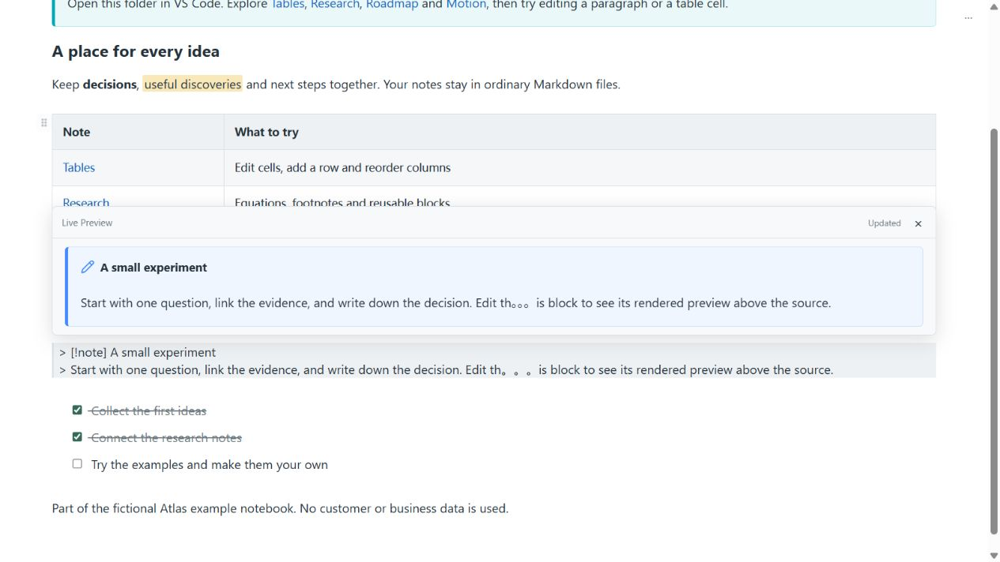
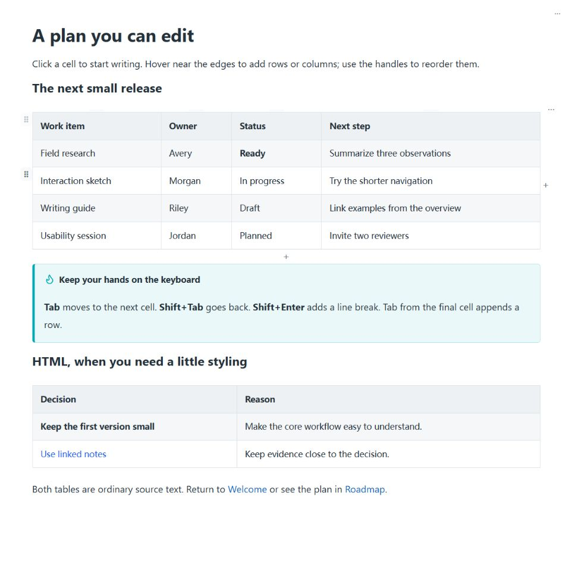
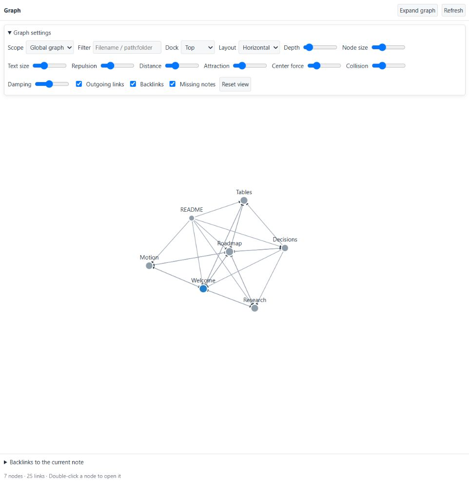

# Note Workbench — Obsidian-style Editor


**在 VS Code 中阅读、编辑和连接 Markdown 笔记。**

[English](README.md) · [安装](https://marketplace.visualstudio.com/items?itemName=jiaque.note-workbench) · [体验样例](example/README.md) · [反馈问题](https://github.com/jiaque/note-workbench/issues)

在现有工作区中使用 Obsidian 风格的实时预览、可编辑表格和笔记连接图。支持 Markdown 与受支持的 HTML 混排，编辑时可在浮层查看渲染结果；笔记始终保存在普通 `.md` 文件中。

**按已确认范围，第一阶段功能开发已完成。** 后续改进和剩余验收见[第一阶段范围](docs/phase-one.md)。

## 功能展示

### 边编辑，边查看块预览

点击内容块进入源码编辑，上方浮层实时展示修改结果，其他内容保持渲染状态。



对应样例：[example/Welcome.md](example/Welcome.md)。

### 直接操作表格

编辑单元格、增删行列，使用边缘手柄调整普通 Markdown 和 HTML 表格的行列顺序。



对应样例：[example/Tables.md](example/Tables.md)。

### 沿着连接阅读笔记

通过全局／局部连接图导航笔记，并从带上下文的反向链接定位来源。



对应样例：[example/](example/README.md)。截图来自插件本地 Webview 预览，内容均为专门编写的虚构样例，不含用户业务文档；截图不包含 VS Code 窗口外框。

## 安装与开始使用

需要 **VS Code 1.100.0 或更新版本**。使用打包后的扩展无需安装 Node.js、npm、Obsidian 或 Obsidian Visualizer。

1. 打开**扩展**面板，搜索 `@id:jiaque.note-workbench`。
2. 安装发布者 **jiaque** 的 **Note Workbench — Obsidian-style Editor**。
3. 打开笔记文件夹，再打开 `.md` 文件。
4. 点击活动栏的 **Note Workbench** 图标查看连接图。

也可以[打开扩展商店页面](https://marketplace.visualstudio.com/items?itemName=jiaque.note-workbench)，或执行：

```sh
code --install-extension jiaque.note-workbench
```

插件会注册为 Markdown 默认编辑器候选。如果已指定其他编辑器，VS Code 会保留原选择。右键文件标签页，选择**重新打开编辑器的方式 → 配置默认编辑器 → Note Workbench**。使用 **⋯ → 在 VS Code 中编辑** 可打开原生源码编辑器。

建议下载或克隆本仓库，在 VS Code 中打开整个 [example](example/README.md) 文件夹，从 [Welcome.md](example/Welcome.md) 开始。Wiki 链接和笔记嵌入需要在插件中体验，GitHub 不会渲染这些语法。

## 核心功能

| 类别 | 已包含 |
| --- | --- |
| 编辑 | 实时预览、阅读／源码视图、可配置块预览浮层、保存、自动保存、原生撤销／重做 |
| Markdown 与 HTML | CommonMark/GFM、受支持的 HTML、Callout、高亮、注释、脚注、代码高亮及 YAML 属性 |
| 公式与图表 | 本地打包的 MathJax、Mermaid，支持源码编辑和渲染 |
| 笔记链接 | Wiki 链接、别名、标题／块引用、补全、缺失笔记创建及整篇／标题／块嵌入 |
| 连接图 | 全局／局部图、反链、过滤、缩放平移、拖动和布局参数记忆 |
| 表格 | 单元格编辑、增删行列、拖动排序、键盘移格和新建 Markdown 表格 |
| 附件 | 本地图片、可配置 HTTPS 图片、音视频及嵌入 PDF 翻页 |
| PDF 导出 | 使用本机 Chrome／Edge，导出受支持的样式、公式、图表、图片和笔记嵌入 |
| 展示 | 笔记库 CSS、显式 CSS 动效和隔离显示的动态 SVG |
| 语言 | 中文和英文，默认跟随 VS Code |

阅读与实时预览共用正文和表格布局。源码始终是保存依据，局部表格编辑不会将整篇笔记转换为另一种格式。

## 常用操作

右上角 **⋯** 菜单提供视图切换、插入表格、属性、PDF 导出、动效控制和保存。格式按钮不再放在这个菜单中。

| 操作 | 快捷键或入口 |
| --- | --- |
| 保存 | `Ctrl/Cmd+S`；同时遵循 VS Code 自动保存设置 |
| 切换编辑／阅读 | `Ctrl/Cmd+E` |
| 加粗／斜体 | `Ctrl/Cmd+B`／`Ctrl/Cmd+I` |
| 链接／删除线 | `Ctrl/Cmd+K`／`Ctrl/Cmd+Shift+X` |
| 表格下一格／上一格 | `Tab`／`Shift+Tab` |
| 完成单元格编辑／格内换行 | `Enter`／`Shift+Enter` |
| 表格末尾加行 | 最后一格按 `Tab`，或点击底部 `+` |
| 调整行列顺序 | 边缘手柄或表格菜单 |
| 补全笔记／标题／块 | `[[`、`[[笔记#` 或 `[[笔记#^` |

离开编辑块后，修改同步到 VS Code 文本文档；磁盘保存由自动保存或手动保存决定。外部修改冲突时，笔记菜单提供对比、草稿恢复和采用外部版本等操作。

标题、引用、行内代码和列表可以输入常规 Markdown 语法，更多一键格式快捷操作暂缓。缺失链接会先提供创建选项，再新建笔记。

## 设置

在设置中搜索 `noteWorkbench`，配置项按以下顺序排列：

| 配置项（均带 `noteWorkbench.` 前缀） | 默认值 | 用途 |
| --- | --- | --- |
| `language` | `auto` | 跟随 VS Code，或选 `zh-CN`／`en`；修改后重载窗口 |
| `editor.blockPreview.enabled` | `true` | 编辑非表格块时显示预览浮层 |
| `render.motion.enabled` | `true` | 启用动效，遵循减少动态效果偏好，立即生效 |
| `render.remoteImages` | `true` | 允许 HTTPS 图片，修改后重新打开笔记 |
| `styleSheets` | `[]` | 相对笔记库的 CSS 文件路径，按顺序应用；修改后重新打开 |
| `notes.newLocation` | `current` | 当前目录、库根目录 `root` 或自定义目录 `folder` |
| `notes.newFolder` | 空 | 选择 `folder` 时使用的库内相对目录 |
| `graph.include` | `[]` | 图谱包含规则，留空包含全部 Markdown |
| `graph.exclude` | `**/{node_modules,.git,.npm-cache}/**` | 图谱排除规则 |
| `pdf.browserPath` | 空 | Chrome／Edge 可执行文件路径，留空自动检测 |

自动模式下，中文 VS Code 使用简体中文，其他语言回退英文。设置说明、命令名称和侧栏标题始终跟随 VS Code 自身语言，不受插件语言设置影响；笔记内容不会被翻译。

## CSS 动效与 SVG

每个块需要显式启用动效，例如：

```html
<div data-nw-effect="progress-striped"
     style="--nw-progress:60%;--nw-color:#2563eb;">
  示例计划：已完成 60%
</div>
```

提供持续动效、入场和悬停等 34 个预设。通过 **⋯ → 动效控制** 暂停／恢复或重播 SVG；关闭动效后保留静态内容和进度值。

可以直接手写 SVG。受支持的 CSS／SMIL 动画经过过滤后，在隔离图片中播放；不支持 SVG 脚本和图片内部的交互控件。PDF 使用静态基础画面。

体验 [example/Motion.md](example/Motion.md)。完整参数和边界见[动效设计](docs/css-motion-design.md)与[实现记录](docs/motion-implementation.md)。

## 支持范围与限制

- **表格：**合并单元格、嵌套／不规则 HTML 表格、混合 HTML 容器内表格使用源码编辑；不含可视化合并／拆分、跨表格粘贴和拖动列宽。
- **HTML：**展示时限制标签、样式和 URL，不执行任意脚本，不在所有 HTML 容器内递归解析 Markdown。
- **PDF：**需要本机 Chrome／Edge。附加 PDF 和音视频以文字提示代替，不合并附件页或播放媒体；超宽表格及自定义打印布局需检查结果。
- **工作区：**优先支持 Windows 桌面本地文件夹。大文件优化、多根／远程／Web 验证和查询等不属于已完成阶段。
- **验收：**自动测试和宿主检查覆盖特定场景，真实输入法、多窗口恢复、完整键盘／可访问性、主题／缩放和性能验收仍待完成。

详见[第一阶段范围与后续工作](docs/phase-one.md)，本项目不承诺兼容所有 Obsidian 插件及主题。

## 本地开发

开发需要 **Node.js 22+ 和 npm**。

```sh
npm ci
npm run typecheck
npm test
npm run build
```

在 VS Code 打开仓库，按 **F5** 启动开发窗口。默认工作区为合成测试样本，对外演示样例位于 [example/](example/README.md)。

```sh
npm run test:extension
npm run package
```

输出 `artifacts/note-workbench-<version>.vsix`，通过**扩展 → ⋯ → 从 VSIX 安装**试用。打包不会自动发布或推送。正式 ID 为 `jiaque.note-workbench`，`local-development.note-workbench` 是维护用独立身份，同一工作流中避免同时启用两者。

宿主测试使用隔离配置。设置 `NOTE_WORKBENCH_VSCODE` 指向本机 VS Code 可跳过默认运行时下载。`npm run preview` 仅供开发预览，修改在内存中，不写回样例文件。参见[截图复现说明](docs/images/README.md)。

## 反馈与许可

[反馈问题](https://github.com/jiaque/note-workbench/issues)时，请提供 VS Code／插件版本、最小复现笔记和预期／实际行为；分享前移除私人信息。

项目代码采用 [Apache-2.0](LICENSE)。见 [NOTICE](NOTICE) 与[第三方声明](THIRD_PARTY_NOTICES.md)。相关文档：[开发设计](docs/development.md)、[格式兼容](docs/obsidian-compatibility.md)、[更新日志](CHANGELOG.md)。

Note Workbench 是独立项目，非 Obsidian 官方产品，也未获其背书。Obsidian 等商标归各自权利人所有。
