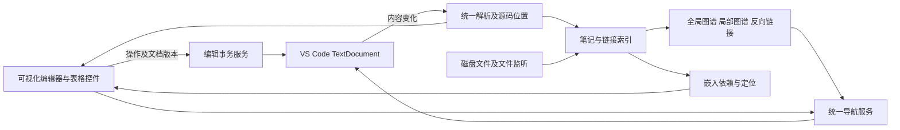

# VS Code 独立笔记扩展开发文档

版本：v0.2 · 日期：2026-09-18 · 状态：开发设计；实际实施及验证进度见 [开发状态](status.md)

对应需求：[需求文档 v0.3](requirements.md)。本文中的目录、接口、脚本及流水线是拟实施设计，不代表已经创建或验证。Git 已按用户后续授权在本目录初始化并本地提交，远端由用户自行管理；Marketplace 发布等功能完善后再安排；发布流程保留为后续参考。内部代号暂用 `note-workbench`，不是已注册的扩展名。

## 1. 交付目标与首版发布条件

交付一个独立安装、独立升级的 VS Code 扩展，提供笔记图谱、可视化编辑、Markdown/HTML 混排和可交互表格。现有 Obsidian Visualizer 用作图谱能力与本地定制的参考来源，内置 Markdown Editor 用作编辑体验参考；新扩展运行时不要求安装原第三方扩展。

用户确认的首版必需内容：

- 需求文档中的全部 P0，包括活动栏、全局/局部图谱、反向链接、阅读/可视化/源码编辑、数据保真与两类普通表格增删。
- 完整语法清单 M-01～M-12：公式、Mermaid、整篇/标题/块嵌入、块引用、脚注、提示块等必须实现。
- 表格 T-01～T-14：在增删和单元格编辑之外，支持拖动调整行、列顺序。
- 可复现构建的本地源码、可独立安装的 VSIX 和试用说明；由用户将源码纳入其 Git 仓库。保留 Marketplace 上架能力，当前不执行发布。

首个正式版本建议为 `1.0.0`。内部 `0.x` 构建可以逐步验证，但不能在核心功能缺失时将“首版已完成”作为交付结论。源码交付、VSIX 安装成功、Marketplace 发布成功及搜索验证是四个不同状态，分别记录。

当前本地交付以全部功能验收 A01～A23 为完成条件。A24 及账号注册、商店素材和自动发布流水线延期，不作为当前开发阻塞项。

## 2. 架构决策

### 2.1 数据与宿主

采用 TypeScript、VS Code 稳定 API、`CustomTextEditorProvider` 和独立 Webview。`TextDocument` 是当前打开文档的权威状态；未打开文档从 `workspace.fs` 读取。编辑器前端只维护可重新同步的显示状态，图谱和嵌入只维护可重建索引。

保存、自动保存和基础备份沿用 VS Code 文本文档机制；扩展负责将前端改动写回文档以及同步其他视图。[Custom Editor API](https://code.visualstudio.com/api/extension-guides/custom-editors)

不依赖 `enabledApiProposals`、VS Code 安装目录内的模块路径或原插件的私有内部对象。官方文档说明 proposed API 不应作为 Marketplace 扩展的发布依赖，因此内置编辑器适配层不能不加区分地复制。[Proposed API 发布限制](https://code.visualstudio.com/api/advanced-topics/using-proposed-api#sharing-extensions-using-the-proposed-api)

### 2.2 编辑内核基线

基线采用 CodeMirror 6 管理输入、选区和源码位置，在其上建立实时渲染装饰与块级控件；普通正文直接编辑，表格作为可编辑网格，公式和 Mermaid 作为可展开局部源码的渲染块。CodeMirror 是浏览器编辑组件，所需笔记语法、图谱和表格控件由本项目实现，不能将组件选型当成能力已经具备。[CodeMirror 项目](https://github.com/codemirror/dev)

界面行为：普通段落呈现排版后的文字；进入当前语法区域时可以显示必要标记，离开后恢复渲染。格式按钮操作源文本范围。公式、图形点击后在原处打开源码输入和预览；普通表格必须直接改单元格，不退化为编辑整张表格源码。复杂 HTML 按需求提供局部源码入口。

`@vscode/markdown-editor` 仅作为替代候选：如果其可发布依赖、授权、可扩展接口、中文输入、HTML 保真和全部 P0 测试都通过，可在架构决策记录中更换内核。未验证前不从本机安装目录导入该包，也不阻塞基线开发。

关键设计是“从源码产生视图，操作映射回源码区间”。不使用整篇 HTML 反向转换 Markdown 的保存路径，也不把所有内容装进会丢弃未知节点的富文本模型。

### 2.3 模块关系



| 模块 | 职责 | 不承担的职责 |
| --- | --- | --- |
| Extension Host | 文件、文档版本、编辑事务、索引、导航、配置、生命周期 | 不从用户文档执行脚本 |
| Webview 编辑器 | 输入与选区、渲染、悬停控件、拖动反馈、局部错误展示 | 不直接保存文件，不自行决定跨文件写入 |
| 共享解析模块 | 语法识别、源码区间、引用与块节点、表格结构 | 不序列化整篇文档以保存 |
| 链接/嵌入服务 | 目标解析、反向依赖、循环检测、目标范围与来源信息 | 不把展开内容写回宿主笔记 |
| 图谱视图 | 展示关系、筛选、交互布局 | 不拥有第二套链接解析规则 |

## 3. 拟用组件与选型验证

| 领域 | 基线方案 | 第一个技术验证需确认 |
| --- | --- | --- |
| Markdown 解析 | unified/remark、micromark 体系，GFM、frontmatter、math 插件及自定义笔记语法扩展 | 语法优先级、源码区间完整性、浏览器与宿主一致性 |
| 交互输入 | CodeMirror 6 + 本项目渲染装饰和控件 | IME、隐藏标记后的选区、块控件输入与 VS Code 撤销对接 |
| HTML 结构 | parse5 等支持源位置的 HTML 解析工具 + 原始文本切片 | 隐式节点、属性/注释、可选闭合标签及表格源码映射 |
| 数学公式 | 本地打包 MathJax TeX 组件 | 常用宏、矩阵/对齐、离线字体与模块、渲染取消及安全配置 |
| Mermaid | 本地打包官方 Mermaid，按需加载所锁定版本的稳定图类型 | 离线资源、严格安全模式、错误隔离和渲染队列 |
| 图谱 | 复用/重构现有 D3 图谱实现 | 清晰源码来源、许可、侧边栏定制恢复、增量数据更新 |
| 构建 | npm 锁文件、TypeScript、esbuild，宿主与 Webview 分开打包 | VS Code API external、动态模块与资源完整打包 |
| 测试 | 单元测试工具、浏览器组件测试、`@vscode/test-electron` 宿主集成测试 | 真实 VSIX 环境中的撤销、保存、输入和离线加载 |

remark 提供结构化 Markdown 解析及扩展机制；parse5 是 HTML 解析工具。两者都不能自动替代本项目的源码保真策略。[remark](https://github.com/remarkjs/remark)、[parse5](https://github.com/inikulin/parse5)

MathJax 的组件可用于网页集成。本项目选择接近 Obsidian 常见 TeX 使用方式的方案，必须把所需组件、字体及扩展资源收齐，不能照搬依赖 CDN 的示例。[MathJax 组件说明](https://docs.mathjax.org/en/latest/web/start.html)

所有依赖在初始化时选定兼容版本并写入锁文件和第三方许可清单。构建使用当时受支持且满足工具要求的 Node.js LTS，固定于开发环境与 CI；VS Code 的最低版本根据实际使用的稳定 API 确定，不直接照抄原插件 `^1.0.0` 或本机版本。

本机环境已于 2026-09-18 检查：`node --version` 为 `v26.2.0`，`npm --version` 为 `12.0.2`。无需重复安装 npm；初始化时先验证现有环境与构建工具兼容性，再确定需要固定的工具版本。此记录不代表当前 Node.js 版本已完成项目兼容验证。npm 仅用于开发、测试和打包，最终用户安装 VSIX 后无需额外安装 Node.js/npm，也无需启动独立服务。

## 4. 仓库结构与维护方式

使用一个 TypeScript/npm 项目；npm 管理开发依赖和构建。Git 仓库的位置、分支及上传由用户自行安排，允许本地初始化和提交，不自动创建远端仓库或推送。以下为规划目录，`.github/workflows` 中的 CI/发布文件属于后续可选接入，不是本地开发前置条件：

```text
note-workbench/
  src/
    extension/            # activate、贡献点、注册与销毁
    documents/            # TextDocument 会话、版本与事务
    navigation/           # 活跃笔记、定位、历史
    index/                # 文件索引、链接、块、嵌入依赖
    shared/
      protocol/           # 消息协议及运行时校验
      syntax/             # Markdown/HTML/笔记语法解析
      edits/              # 源码范围、局部修改与映射
      tables/             # 行列网格、操作和源码回写
    webview/
      editor/             # 阅读、实时编辑、源码块
      renderers/          # HTML、MathJax、Mermaid、嵌入
      tables/             # 单元格、菜单、拖动和键盘操作
      graph/              # D3 视图与布局控件
      styles/             # 主题和可访问性
  test/
    unit/
    component/
    extension/
    fixtures/             # 仅合成或明确可公开的笔记样本
    conformance/          # 规范样本及兼容差异清单
  media/                  # 原创图标、本地资源、公开截图
  docs/
    requirements.md      # 发布到 GitHub 时转换为可移植版本
    development.md
    syntax-compatibility.md
    release.md
    adr/                 # 有影响的架构决策记录
  .github/workflows/
    ci.yml
    release.yml
  package.json
  package-lock.json
  README.md
  README.zh-CN.md
  CHANGELOG.md
  LICENSE
  THIRD_PARTY_NOTICES.md
  CONTRIBUTING.md
  SECURITY.md
  .gitignore
  .vscodeignore
```

GitHub 公共文档使用仓库相对链接；本次调研文档中的本机绝对路径移入不打包的本地记录，公开版仅保留可核实的上游来源与概述。不能把原扩展安装目录整体提交：其中可能有备份、无关 PDF、个人材料及打包文件，不能作为新项目源码。

后续 Git 分支与 PR 流程沿用用户仓库约定，不预设或修改默认分支。提交记录可关联需求编号、相关样本和验收结果。新写代码建议采用 MIT，正式发布前确定许可证；复用代码保留各自版权及许可，不自动将所有第三方内容改成项目许可证。

## 5. 扩展贡献点与生命周期

以下 `noteWorkbench` 为内部命名空间，首次公开发布前统一确定。

| 贡献点 | 设计 |
| --- | --- |
| 自定义编辑器 | `noteWorkbench.editor`，匹配 `*.md`；以可选编辑器注册，用户可设为默认 |
| 活动栏 | `noteWorkbench`，独立图标 |
| 视图 | `globalGraph`、`localGraph`、`backlinks`；全局图另可打开到编辑区域 |
| 命令 | `openEditor`、`openSource`、`toggleReadMode`、`showGlobalGraph`、`showLocalGraph`、`rebuildIndex`、`insertTable` |
| 表格命令 | 增删行列及 `moveRowUp/Down`、`moveColumnLeft/Right`，与拖动共用操作逻辑 |
| 设置 | 笔记库包含/排除、图谱参数、嵌入深度、远程图片、语法选项与性能上限 |
| 配置持久化 | 图谱布局、编辑模式和局部视图状态；正文仍在文本文档中 |

打开编辑器/视图时激活；普通文件夹未使用笔记功能时不进行全量扫描。首次需要索引才后台扫描，报告进度；隐藏图谱暂停不必要的动画。取消过时解析任务，关闭视图时解除监听与渲染任务。

旧扩展共存：不注册相同命令和视图 ID；旧设置只读导入可公开读取的参数，写入新命名空间。旧布局私有状态不能直接假定可读，允许在新面板恢复相同布局。无需替用户卸载旧扩展；说明如何在试用后按工作区禁用重复图谱功能。

## 6. 文档协议、同步与撤销

### 6.1 协议约束

Webview 初始化由宿主绑定 URI，前端不能发送任意文件路径要求写入。消息经运行时校验，包含协议版本、视图会话、操作 ID 和基础文档版本。源码偏移统一为 JavaScript/VS Code 对齐的 UTF-16 code unit，并正确处理 CRLF 与 emoji。

```ts
type EditRequest = {
  type: 'edit';
  protocolVersion: 1;
  sessionId: string;
  operationId: string;
  baseDocumentVersion: number;
  replacements: Array<{
    from: number;
    to: number;
    expectedText: string;
    insert: string;
  }>;
  selectionAfter?: { anchor: number; head: number };
};

type EditResult =
  | { type: 'ack'; operationId: string; documentVersion: number }
  | { type: 'reject'; operationId: string;
      reason: 'stale' | 'readonly' | 'invalid'; documentVersion: number };
```

另定义初始化快照、文档更新、打开链接、渲染诊断及撤销/重做消息；导航消息也校验来源会话和 URI。更新带修订号及操作关联信息，防止视图回声形成循环。

### 6.2 事务流程

1. 每个 URI 建立串行写队列，前端保留已确认快照与未确认输入。
2. 宿主校验会话、只读状态、当前版本、非重叠有效范围及 `expectedText`；对表格等结构操作重新校验目标节点。
3. 将替换集合提交为一次文档编辑，通过稳定文本编辑 API 写回；检查实际结果并广播新版本。
4. 前端依据变更映射选区及待发送文本输入；确认前不清空未确认输入。普通文本可在映射有效时重放，结构操作版本过期则取消。
5. 原有文档变化事件同时驱动图谱、嵌入刷新及其他可视化视图。收到自身操作确认时不重复提交或记录历史。
6. 校验与应用之间仍可能出现外部变更，不能把扩展内部队列视为全局锁；原型阶段必须验证所选 VS Code 编辑路径的版本冲突行为。应用失败或结果不符时重新同步，并保留未提交输入供恢复。

### 6.3 历史与输入

VS Code 文档历史为唯一撤销来源；不再启用一套独立 CodeMirror 文件历史。Ctrl+Z/重做转交给绑定文档的宿主历史路径，不能因为用户刚点击图谱而撤销另一个文件。

行列增删、一次拖动、单次格式操作各提交一个原子事务。普通输入的事务分组在原型中验证，避免每个中文组合字符单独撤销或一次撤销整段历史。中文 `compositionstart/end` 期间保留输入区域，不重建该块 DOM。

如果稳定 API 无法满足自定义编辑器中准确的撤销目标和分组，阶段一必须调整宿主适配并给出真实验证结果；不能用 proposed API 或独立隐藏副本绕过。所有未确认输入在视图异常恢复路径中保留，避免宣称 VS Code 自动备份了尚未提交到 TextDocument 的输入。

## 7. 解析、渲染与局部回写

### 7.1 统一语法配置

建立 `syntaxProfile`，固定 CommonMark/GFM 基线与 M-01～M-12 扩展。宿主和 Webview 使用同一份解析配置，代码、公式、HTML、链接等优先级通过样本固定，不能用全文正则依次替换所有特殊符号。

建议解析顺序：识别 frontmatter、代码围栏及 HTML 边界；解析 Markdown 块和行内结构；由语法扩展处理 Wiki 链接/嵌入、公式、块 ID、脚注、提示块和注释；随后提取索引。将代码内的 `[[链接]]` 或 TeX 中的字符错误识别成笔记链接属于阻断缺陷。

解析输出至少包含节点类型、源 URI、源码起止位置、文档版本和与渲染实例无关的引用目标。AST 不保证完整保留所有标点，因此原始源码始终随快照保留。内部节点 ID 在编辑后映射或重建，不能替代文档版本检查。

CommonMark 与历史 GFM 规范可能存在差异：使用测试适配层记录冲突及选择，普通 Markdown 模式以 CommonMark 基础语义加明确扩展为准。对规范原始 HTML 的限制放在安全展示层说明，不把“有意禁止脚本”藏成解析失败。

### 7.2 局部修改原则

- 普通文字只替换命中的源码范围；HTML 属性、注释、frontmatter 和无关空格不动。
- 表格结构操作可以替换该张表格的局部源码，但不能重新生成整篇文章。
- 新增节点生成规范语法；移动既有节点优先移动原始切片，保留内部标记。
- 阅读、焦点切换、主题切换和渲染刷新都不能触发文档编辑。
- 超出安全映射范围的复杂 HTML 进入源码块编辑，不修改未经用户编辑的原文。

### 7.3 HTML 显示与来源

HTML 解析保留 source location；浏览器隐式插入的 `tbody` 等不能误认为原文真实存在。表格回写使用源位置和实际文本结构，必要时仅在被编辑表格内明确补齐语法，不从清洗后的 DOM 直接序列化整篇。

清洗后的显示树与原始源码分离。执行 CSP、资源 URI 转换、受控本地资源范围和消息校验；用户 HTML 不得拥有扩展的脚本权限。外部链接通过受控打开路径处理，文档中的 `command:` 与脚本链接不直接执行。Webview 资源和消息的具体接入遵循官方 API。[Webview API](https://code.visualstudio.com/api/extension-guides/webview)

不受信任工作区仍可使用本地文本、受限渲染和结构编辑，不执行工作区脚本，也不加载工作区提供的 JavaScript/CSS。嵌入和本地资源访问限制在已打开笔记库内，校验相对路径及符号链接解析后的实际范围；库外目标显示链接，不自动读取并嵌入。公式/图形使用随扩展打包的资源，不把文档内容作为宿主命令。

## 8. 公式与 Mermaid

### 8.1 公式

`$...$` 与 `$$...$$` 使用语法级识别，覆盖转义、货币文本歧义、多行表达式及代码中的美元符号。支持行内和独立公式块；公式输入焦点不因后台渲染结果返回而丢失。

首版样本至少包括分式、根式、上下标、希腊字母、求和积分、cases、矩阵、aligned、编号/引用以及明确启用的常用 TeX 宏。所用 TeX 扩展列表、编号规则和宏作用域写入 `syntax-compatibility.md`；同一渲染文档使用隔离状态，嵌入公式按来源上下文处理，不能把宏泄漏到其他笔记。

按需加载本地 MathJax 组件，异步结果附文档版本和块 ID；旧结果丢弃。限制输入长度和资源消耗；启用适用的安全选项，禁止通过公式加载远程代码。安全组件的选项须按锁定版本验证。[MathJax Safe 配置](https://docs.mathjax.org/en/latest/options/safe.html)

语法错误显示原公式和局部诊断，修复后恢复图形；不影响正文保存。不能因使用某个渲染库就宣传支持全部 LaTeX 宏包。

### 8.2 Mermaid

识别语言为 `mermaid` 的代码围栏，按固定版本加载全部稳定图类型；对其官方图类型清单建立样本覆盖，需求中列出的常见图必须有专门用例。实验性语法在兼容表中列明，不能把已承诺的稳定类型漏包。

采用串行或受控并发渲染队列，按源码、主题、版本缓存。每个实例的 SVG ID 加唯一前缀，避免同篇多个图、嵌入重复图互相影响。异步结果返回前校验版本；输入错误只影响当前图。

初始化使用 `securityLevel: 'strict'`，锁定安全配置，不允许文档内指令降低等级；默认禁止图中任意 JavaScript 回调。官方说明 strict 模式限制 HTML 和点击功能，因此笔记导航由扩展自己的链接机制提供。[Mermaid 安全配置](https://mermaid.js.org/config/schema-docs/config.html#securitylevel)

## 9. 笔记、标题、块引用及嵌入

### 9.1 索引模型

```ts
type Target = {
  noteUri: string;
  fragment?: { kind: 'heading' | 'block'; value: string };
};

type Reference = {
  sourceUri: string;
  sourceRange: { from: number; to: number };
  kind: 'link' | 'embed';
  rawTarget: string;
  resolved?: Target;
  status: 'resolved' | 'missing' | 'ambiguous';
};
```

每个笔记记录路径、文件名、aliases、标题范围、块 ID 范围、出链及修订号。维护反向引用、反向嵌入依赖和稳定图谱节点映射；缓存可删除重建，配置或语法版本改变后失效。

### 9.2 解析与定位规则

Wiki 路径按明确路径、当前目录、笔记库候选逐级解析；裸文件名/别名重名时展示候选，不猜测。普通 Markdown 相对链接按来源文件目录解析。保留原始书写，Windows 用规范 URI 对比但不在保存时重写大小写。

标题嵌入范围为目标标题至下一个同级或更高级标题之前；嵌套标题路径与重复标题需提供明确定位规则和歧义提示。块 ID 按所属段落或独立 ID 行绑定前一个合法块；支持段落、列表、引用、代码和表格，用官方 Obsidian 样例与自建边界样本验证。重复 ID 报诊断，不跳到随机匹配。

块、标题补全复用同一索引，在源码和可视化编辑中均提供。块引用 `[[笔记#^id]]` 和普通引用段落 `>` 是两个概念，两者都支持。[Obsidian 内部链接说明](https://help.obsidian.md/links)

### 9.3 嵌入渲染

处理 `![[笔记]]`、`![[笔记#标题]]` 和 `![[笔记#^id]]`；相同来源解析能力也用于 Wiki 图片嵌入。Obsidian 的嵌入语法作为兼容参考，本项目行为以需求矩阵为准。[Obsidian 嵌入说明](https://help.obsidian.md/embeds)

嵌入渲染携带 `originUri`、源范围、源版本与宿主实例 ID；其中相对图片、链接、公式和嵌套嵌入按来源解析。默认显示只读内容和“编辑来源”，点击打开源文档；不在宿主中隐式开启跨文件编辑。

使用当前展开路径检测循环；建议初始深度上限 5、单个宿主最多展开 100 个嵌入实例，均为可调整的性能保护配置。遇到 A→B→A、自引用、超限或缺失目标时显示带原因的可跳转占位，原引用可继续编辑。

对渲染实例中的标题、脚注、公式锚点加命名空间；导航服务映射回真实来源。仅索引源文件实际包含的引用：A 嵌入 B，B 链接 C，应有 A→B 与 B→C，不额外生成 A→C。

修改 B 的未保存内容后，B 的所有可见嵌入更新；丢弃修改时回退。重命名/删除使依赖失效并重算；首版检测失效，但跨库批量重写已有引用仍按 P1 管理。

## 10. 表格编辑与拖动排序

### 10.1 统一结构模型

解析普通矩形 Markdown/HTML 表格为 `TableModel`：源码范围和版本、行分区、行列身份、每个单元格的原始源码切片、列对齐及属性映射、可执行能力集。HTML 保留 `caption`、分区、行属性和列定义；原始换行符不转换。

`rowspan/colspan` 合并单元格、嵌套表格、无法解释的不规则网格进入“可渲染、源码可编辑、禁结构操作”状态，并显示原因。普通表格的复杂单格内容不使整张表自动失去增删/排序能力，优先保留单格原文切片。

### 10.2 统一操作接口

```ts
type TableOperation =
  | { kind: 'setCell'; row: number; column: number; text: string }
  | { kind: 'insertRow'; at: number; section: string }
  | { kind: 'deleteRow'; row: number }
  | { kind: 'insertColumn'; at: number }
  | { kind: 'deleteColumn'; column: number }
  | { kind: 'moveRow'; from: number; to: number; section: string }
  | { kind: 'moveColumn'; from: number; to: number };
```

接口经表格句柄关联源范围、版本和能力集；`to` 定义为移除原项之后的最终下标，前端插入线位置统一换算，避免移动到后方时偏一格。菜单、键盘和拖动调用相同实现。

计算补丁前先验证结构和来源，应用后重新解析检查矩形、分区及列数，再提交宿主。无效补丁不写入文件。

### 10.3 Markdown 回写

使用语法 token 和源码范围分列，不使用简单 `split('|')`。覆盖转义管线符、代码跨度及单元格中的链接/强调/HTML。移动列时同时移动表头、分隔行的对齐标记和全部数据行的单元格切片。

数据行可任意移动；表头和分隔行固定。对规范允许的缺失/多余单元格，解析保留实际文本并判定结构操作是否可安全规范化；不得在重排时抹掉额外内容。出现会丢失内容的结构时明确转源码修复，普通矩形表格必须直接可编辑。

仅结构变化的表格范围可以整理分隔空格，不改变未操作单元格内部内容。输入单元格时通过局部编码处理管线符与 `<br>`，防止用户键入字符变成意外的新列。

### 10.4 HTML 回写

行移动优先搬移整段 `tr` 源码，附属行属性和该行边界内注释一起移动；首版限定在同一分区内。列移动跨所有行同步进行，保留 `th/td` 原类型和属性。表格级注释及 `caption` 保持在原位置。

`colgroup/col` 用逻辑列映射解析：一列一项时同步移动；有 `span` 时先在该表格局部等价展开列定义并保留样式，再进行重排。遇到无法证明等价的列定义时必须给出限制，阶段一纳入样本判断；不能只换单元格却让列宽、样式留在旧列。行属性、单元格内公式/链接和块 ID 随各自所属内容移动，不复制唯一 ID。

新增行按当前分区产生 `th/td`；删除最后一列按需求确认删除整表；HTML 空表和仅表头情况给出合法插入入口。Markdown 与 HTML 表格始终保持原存储类型。

### 10.5 拖动状态机

`idle → armed → dragging → committed/cancelled`：按下手柄记录源行/列、文档版本、起点；超过移动阈值才开始拖动，避免和单元格点击冲突。使用指针捕获，显示移动预览及目标插入线，支持滚动容器边缘自动滚动。

拖动只更新视图状态；释放时验证版本和目标，构建一个 `moveRow/moveColumn` 操作。Esc、窗口失焦、pointercancel、表格消失、无效目标或文档被外部修改时取消。原地释放不创建事务；更新焦点到移动后的单元格并保持可见。

键盘上下/左右移动通过同一操作接口，屏幕阅读器播报新位置。多选批量移动、跨表格移动、按值排序和行高列宽拖动保持后续范围。

## 11. 图谱与当前笔记联动

恢复侧边栏入口和图谱配置面板四边停靠、横竖排列、参数与状态记忆。保留现有节点导航、搜索、方向显示与交互高亮，在新命名空间下实现。

建立 `ActiveNoteService`，接收自定义编辑器激活、普通文本编辑器切换与导航事件。焦点进入侧边栏不清空当前笔记；不使用 `registerTextEditorCommand` 作为局部图谱唯一入口。导航用 `vscode.openWith` 显式打开新编辑器，源码命令进入普通编辑器，补充文档内定位协议。

索引扫描跳过配置排除目录，事件防抖合并；已打开文档以 TextDocument 为准，关闭且不再保留未保存状态后从磁盘重新解析。修改链接时仅更新受影响节点、边和嵌入依赖。重建索引可取消，陈旧任务结果不覆盖新索引。

图谱使用增量数据和稳定节点身份保留布局，不在每次键入时重建力导向模拟。大库优先显示局部关系和筛选结果，全局渲染有渐进加载提示。

## 12. 测试、性能与兼容门槛

### 12.1 必须自动化的测试

| 层次 | 内容 | 对应需求 |
| --- | --- | --- |
| 规范与解析 | CommonMark/GFM 样本及明确差异；全部 M 项扩展语法 | M-01～M-12、A17 |
| 源码保真 | 不编辑文本完全相等；局部操作的无关范围不变；CRLF、Unicode、注释和属性 | E-04、A05/A06 |
| 表格模型 | 增删、所有移动方向、对齐、HTML 分区/列定义、无效结构、原操作与逆操作 | T-01～T-14、A07～A11、A14、A21/A22 |
| 索引与嵌入 | 歧义、块范围、循环、来源 URI、未保存刷新、删除/改名 | W-05/W-06、A16/A19/A20 |
| 渲染组件 | 公式/Mermaid 正确与错误样本，HTML 隔离，悬停、滚动及键盘拖动等价操作 | A04/A12/A15/A18 |
| 宿主集成 | 真实 TextDocument 版本、保存、撤销、分屏、外部修改、图谱导航 | E-03/E-05、A01～A03、A09/A13 |
| VSIX 安装 | 干净配置、没有原扩展、离线资源、重启恢复 | A23 |

VS Code 宿主测试使用官方支持的测试工具接入 CI；浏览器组件测试不能代替真实宿主撤销和磁盘同步测试。[扩展 CI 指南](https://code.visualstudio.com/api/working-with-extensions/continuous-integration)

手动验收补充中文输入法、125%/150% 缩放、浅色/深色/高对比度、触控板/鼠标拖动、真实笔记副本，以及 Marketplace 实际搜索安装。测试结果标明已测平台，首版 Windows 优先；其他平台不能未经验证就声称完全支持。

### 12.2 性能与资源

沿用需求文档的 100 KB 文档、100×20 表格及 1,000 篇笔记基线；拖动过程要求反馈连续，提交后重排与增删采用同一 P95 ≤ 200 ms 目标。另增加含 30 个公式、10 个 Mermaid 图、20 个笔记嵌入的混合样本，测首屏可编辑时间、完整渲染时间与内存。

正文输入不等待图形和远程资源；按可见区域加载公式/图形/嵌入，缓存含依赖版本及主题。性能测试发现大文档不达标时先减少无关重解析和渲染，不能用取消公式或嵌入支持来达到首版指标。

### 12.3 发布阻断条件

存在数据丢失、静默改写未编辑内容、跨文件误保存、撤销错误、文档脚本执行、P0 稳定语法不可用或原扩展缺失即无法运行时，不发布正式版。所有 A01～A23 需有结果；A24 在实际上架后执行，失败则不能宣称“商店可搜索安装”。

## 13. 开发任务与顺序

各任务可以拆 PR，但阶段顺序不改变首版范围。下表的“产出”均为待完成项，不是当前已实现功能。

| 阶段 | 任务 | 依赖 | 产出与通过条件 |
| --- | --- | --- | --- |
| D0 | 冻结语法样本、术语及独立扩展身份草案 | 本次文档 | M/T/A 对应关系和可公开样本 |
| D1 | 仓库脚手架、稳定 API 注册、宿主/Webview 通信、构建 | D0 | F5 可运行，新编辑器能打开文件 |
| D2 | 源码保真与撤销纵向原型，覆盖 HTML、公式、Mermaid、嵌入和两类表格拖动 | D1 | 单份复杂样本全链路成功；内核决策记录，未达标先调整架构 |
| D3 | 补齐全部 Markdown 与 HTML 渲染/编辑，公式图形错误隔离 | D2 | M-01～M-04、M-07～M-11 的解析与编辑测试通过 |
| D4 | 链接、标题/块索引、整篇/局部嵌入和依赖刷新 | D2/D3 | W-05/W-06、M-05/M-06/M-12、A19/A20 |
| D5 | 两类表格全部操作、拖动反馈、键盘等价操作、版本取消 | D2/D3 | T-01～T-14、A21/A22 与保真/撤销测试 |
| D6 | 图谱与工作台，迁移本地面板体验，导航闭环 | D4 | W-01～W-04、A01～A03/A16 |
| D7 | 全量回归、真实笔记副本、性能、离线 VSIX 安装 | D3～D6 | A01～A23 通过，兼容表和已知限制明确 |
| D8（延期） | 用户自行管理 GitHub；功能完善后安排 Marketplace 上架与搜索安装验证 | D7、用户后续发布安排 | 当前不执行，不阻塞本地首版；发布后记录 A24 |

先完成 D2 再承诺精确工期；它集中验证保真、IME、撤销、嵌入及拖动的技术风险。若 D2 失败，需要调整设计或投入，不默认把已确认 P0 移到后续版本。

## 14. GitHub 与构建发布设计

本节仓库公开和远端发布内容保留为后续参考，由用户管理 Git 仓库；当前只落实本地构建、测试和 VSIX 打包所需内容。

### 14.1 仓库交付

正式开发仓库命名建议采用不冒充 Obsidian 官方产品的独立名称；`note-workbench` 仅为暂定代号，需检查可用性。GitHub 用户/组织、最终仓库名、公开时机由项目所有者确定，不影响本地开发。

公开仓库应包含安装步骤、功能截图、语法兼容表、开发命令、测试方式、已知限制、贡献与问题反馈入口。GitHub Release 附版本说明、VSIX 与校验和；源码标签与该 VSIX 的构建提交一致。GitHub Releases 可附分发文件，但不等同于 Marketplace 发布。[GitHub Release 管理](https://docs.github.com/en/repositories/releasing-projects-on-github/managing-releases-in-a-repository)

### 14.2 脚本契约

实现时在 `package.json` 提供以下脚本；当前仅定义名称与职责，命令尚不可运行。

| 脚本 | 职责 |
| --- | --- |
| `npm run dev` | 监听宿主与 Webview 构建，配合 Extension Development Host |
| `npm run typecheck` / `lint` | 类型与静态检查 |
| `npm run test:unit` | 解析、表格、索引及保真测试 |
| `npm run test:component` | 浏览器视图与交互测试 |
| `npm run test:extension` | VS Code 宿主集成测试 |
| `npm run build` | 构建全部运行时代码与离线资源 |
| `npm run package` | 调用锁定的 `@vscode/vsce` 生成 VSIX |
| `npm run verify:package` | 检查包内容、禁用提案依赖、资源完整性及测试安装 |

提交锁文件，CI 用 `npm ci`；构建主机的 Node.js 与 VS Code 扩展运行时分别验证。构建产物留在 CI 和 Release，不把 `node_modules`、密钥、个人笔记或本地调研备份纳入源码/VSIX。[vsce 官方项目](https://github.com/microsoft/vscode-vsce)

### 14.3 CI 与版本发布

`ci.yml` 在 PR 和主分支提交时执行类型、单元、组件、宿主测试及打包检查；至少覆盖声明的最低 VS Code 版本与当前稳定版。Windows 为阻断平台；其他平台在正式承诺支持前增加相应验证。

`release.yml` 由维护者对明确版本手动触发或从受控版本标签触发：检查版本与提交一致 → 运行发布检查 → 构建一次 → 记录 SHA-256 → 上传 GitHub Release → 将同一产物提交 Marketplace。两个远端状态独立记录；一处失败可重试，不能重新构建不同包却仍宣称同一产物。

发布权限只授予发布任务。GitHub 仓库凭据和 Marketplace 凭据是不同权限，不能混用；不要求用户把凭据发到聊天或写进文档。自动认证方案以发布时官方流程为准，首版可先使用管理页面上传已验证 VSIX。

## 15. Marketplace 上架与搜索验收

本节暂不执行。待功能完善、用户决定发布后，再核对当时的平台规则、发布身份与认证方式。

### 15.1 可行性与前置条件

可以把独立扩展发布到 Visual Studio Marketplace，使用户在 VS Code 扩展面板中找到并安装。需要有效 publisher 身份、符合要求的扩展包以及成功的公开发布；单独上传 GitHub 或分享 VSIX 不会自动进入商店。[官方发布指南](https://code.visualstudio.com/api/working-with-extensions/publishing-extension)

首次发布前落实：最终 `publisher` 与 `name`、显示名、版本、描述、README、许可证、原创 PNG 商店图标、仓库和反馈链接、受支持的 `engines.vscode`。`publisher.name` 作为稳定扩展 ID；命令、配置与数据迁移以此身份管理。商店素材与运行时侧边栏图标分别处理。

清单关键词建议使用与实际功能一致的 `markdown`、`notes`、`graph`、`mermaid`、`wiki`、`table`；使用合法分类并说明为独立项目。清单字段最终按官方规则校验，不通过堆砌关键词承诺搜索排名。[扩展清单](https://code.visualstudio.com/api/references/extension-manifest)

### 15.2 首次发布路径

1. D7 通过后冻结候选版本与源码提交，生成并验证 VSIX。
2. 在发布者管理页面创建或使用真实 publisher，核对清单身份与账号权限。
3. 先在全新 VS Code 用户配置中从 VSIX 安装，执行独立运行与离线冒烟测试。
4. 通过官方管理页面上传同一 VSIX，或用 `vsce` 的当前认证方式发布；记录发布结果和详情链接。
5. 等待商店处理后执行搜索安装验收；具体处理与索引时间不预先保证。

发布认证会随平台调整。本次查阅的官方指南优先推荐 Microsoft Entra ID，并注明 Azure DevOps 全局 PAT 将于 2026-12-01 退役；因此长期流水线不写死全局 PAT 方案，发布前重新核对账号可用方式。[发布认证说明](https://code.visualstudio.com/api/working-with-extensions/publishing-extension#publishing-extensions)

### 15.3 如何判定“VS Code 里面可以搜索到”

在联网、版本兼容且没有限制该扩展来源的干净 VS Code 配置中，分别搜索唯一显示名与 `@id:publisher.name`，打开详情，安装后验证活动栏、编辑器及样本文档。记录检索时间、ID、客户端版本和安装结果。扩展面板提供商店检索和安装功能，测试需以实际客户端为准。[Extension Marketplace 使用说明](https://code.visualstudio.com/docs/configure/extensions/extension-marketplace)

精确 ID 能找到但普通关键词暂时没有结果时，记录为检索未完全验证并继续检查名称、发布状态和索引，不宣称排名或曝光已经达标。GitHub 页面提供商店链接与 VSIX 两种入口。当前开发文档完成不代表已经创建账号、仓库或商店条目。

### 15.4 后续版本与回退

使用语义化版本，升级前执行相同保真与包安装检查。修复回退优先发布新的 patch 版本恢复稳定实现，保留上一版 VSIX 和发布记录；不要把删除商店扩展作为常规回退动作。配置变化提供迁移说明，缓存版本升级可重建，升级不自动改写笔记正文。

## 16. 本轮已确定与待落地事项

### 2026-09-18 实时预览实现补记

0.3.0 按第 2.2 节的原设计替换早期的“渲染块按钮 + 显式应用草稿”。整篇文档由持久 CodeMirror 实例承载；StateField 提供光标范围内的格式标记、语法显隐和范围外渲染组件。宿主返回的安全 HTML 同时用于阅读和实时预览，避免维护第二套展示语义。复杂块进入源码编辑时保留文档其他部分，表格提供独立单元格输入。

`LiveSync` 串行发送带版本和原文校验的最小修改，确认回包不替换后续输入；外部冲突停止覆盖并保留本地文本。输入法组合期间不接收会重建输入节点的宿主状态。表格只派发最小源码差异，焦点中的输入框跨回包保留，结构操作仍为一次宿主操作。CRLF 在 Webview 边界映射到 CodeMirror 的 LF 坐标，写回恢复原换行。

保存先排空编辑队列；撤销仍使用 VS Code 文本文档历史，没有引入独立 CodeMirror history。宿主撤销无闪烁、实际 IME、关闭恢复与完整键盘/复杂样式验收继续按第 6.3 节执行，不能把浏览器内存测试等同于实机通过。具体证据和剩余项见 `status.md`。

已确定：独立扩展；首版全部 M/T/P0 功能范围；原始 `.md` 为正文来源；稳定 VS Code API；当前交付本地源码及 VSIX，Git 仓库由用户自行管理，Marketplace 发布延期。

设计基线已给出但待原型验证：CodeMirror 与宿主撤销桥接、HTML 精确回写、完整公式与图类型离线资源、复杂 `colgroup` 的等价处理、真实笔记规模下的性能。

后续公开发布需要落实的身份信息：正式名称、GitHub 所有者/仓库、Marketplace publisher、最终许可证与发布账号授权。它们不阻塞脚手架、核心功能开发和本地 VSIX 验证。现已按用户授权开始本地开发并提交 Git；远端和商店发布仍不执行，当前实现范围见开发状态。
