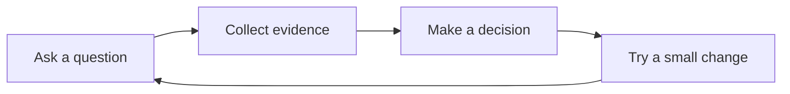

# From question to next step

Use [[Research]] to capture evidence, [[Decisions]] to record a choice, and [[Tables]] to plan the work.

## Keep the evidence visible

![[Research#^observation]]

## Next actions

- [x] Write a short example
- [ ] Review the table in [[Tables]]
- [ ] Try the visual examples in [[Motion]]

Return to [[Welcome]].
