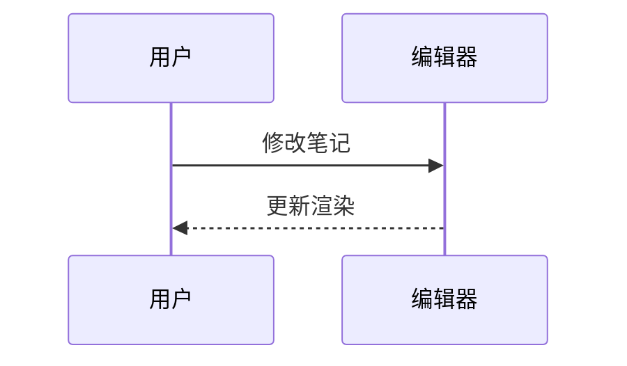

# Obsidian 格式展厅

这是合成测试笔记，不含业务数据。它按官方格式清单覆盖展示行为。

## 行内格式

**粗体** *斜体* ***粗斜体*** ~~删除线~~ ==高亮和 **嵌套粗体**== `行内代码`。

转义：\==不是高亮==，\[[不是链接]]，\#不是标签。#工作/笔记 #中文 #tag #1984

这是 %%不可显示的注释%% 公开正文。

%%
隐藏的多行注释。

# 这里不应成为标题
%%

### 三级标题
#### 四级标题
##### 五级标题
###### 六级标题

有两个空格的硬换行。  
应当另起一行。

---

## 列表与任务

1. 第一项
   - 嵌套无序项
   - 第二项
2. 第二项

- [ ] 未完成任务
- [x] 已完成任务
- [?] 特殊完成标记
- [-] 取消标记

> 普通引用。
>
> > 嵌套引用。

## Callout 全类型

> [!note] 笔记
> 内容。

> [!abstract]+ 摘要（默认展开）
> **富文本**内容。

> [!info] 信息
> 内容。

> [!todo] 待办
> 内容。

> [!tip] 提示
> 内容。

> [!success] 成功
> 内容。

> [!question]- 问题（默认折叠）
> 展开后可见。

> [!warning] 警告
> 内容。

> [!failure] 失败
> 内容。

> [!danger] 危险
> 内容。

> [!bug] 缺陷
> 内容。

> [!example] 示例
> 内容。

> [!quote] 引用
> 内容。

> [!SUMMARY] 大写别名
> > [!check]+ 嵌套别名
> > 可折叠的子块。

> [!unknown] 未知类型回退为 note

## 代码与脚注

```python
def greet(name: str):
    return f"Hello, {name}"
```

```javascript
const result = [1, 2, 3].map(value => value * 2);
```

    这是缩进代码，==不会变成高亮==。

第一个引用[^first]，行内脚注^[支持 **行内格式** 的说明]。

第二段引用[^second]，再次引用[^first]。

[^first]: 第一条脚注。
[^second]: 第二条脚注。

## 公式与 Mermaid

行内公式 $e^{i\pi}+1=0$。

$$
\begin{aligned}
f(x)&=\int_0^x t^2\,dt\\
&=\frac{x^3}{3}
\end{aligned}
$$

$$
\cancel{x}+\color{red}{y}+\begin{pmatrix}a&b\\c&d\end{pmatrix}
$$




## 表格与 HTML

| 左对齐 | 居中 | 右对齐 |
| :--- | :---: | ---: |
| **粗体** | ==高亮== | 125 |
| [[Second\|另一篇笔记]] | `代码` | 20 |

<table><thead><tr><th>HTML 表头</th><th>内容</th></tr></thead><tbody><tr><td><strong>粗体</strong></td><td><mark>高亮</mark></td></tr></tbody></table>

### <span style="background-color:#953734;color:white;padding:4px 10px;border-radius:4px;display:block">HTML 彩色标题</span>

<details><summary>HTML 折叠块</summary><p>HTML 正文。</p></details>

H<sub>2</sub>O，x<sup>2</sup>，<kbd>Ctrl</kbd> + <kbd>S</kbd>。

<svg viewBox="0 0 200 60" role="img" aria-label="静态图形"><rect x="4" y="4" width="190" height="50" rx="5" fill="#edf4fc" stroke="#1565c0"/><text x="18" y="35" fill="#1565c0">SVG chart</text></svg>

## 链接和嵌入

[[Second|别名]] · [[Second#第二篇笔记]] · [[Second#^sample-block]] · [[#行内格式]]。

![[Second#第二篇笔记]]

![[Second#^sample-block]]

![[Missing note]]

![[Formatting]]

## 附件

![[sample.svg|240x80]]


![[sample.pdf#page=1]]

![[sample.wav]]

![[sample.canvas]]
