# Mermaid 类型回归样本

## Flowchart
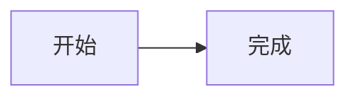

## Sequence
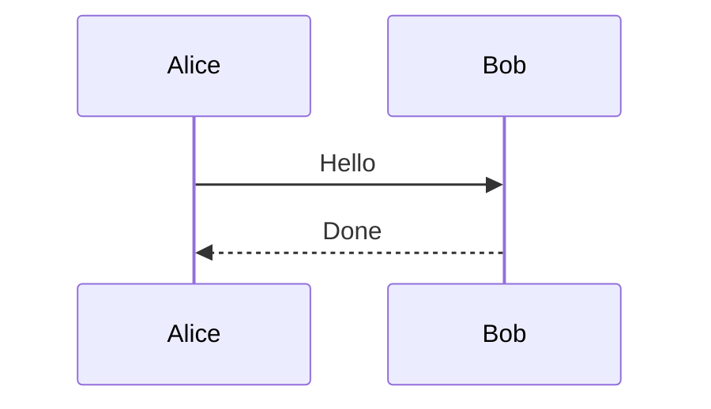

## Class
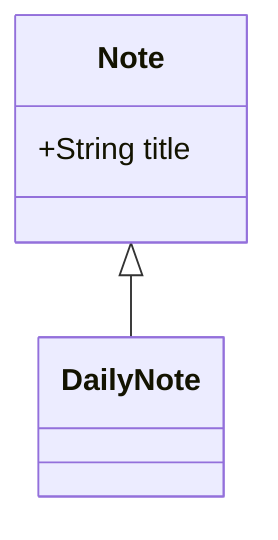

## State
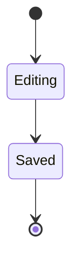

## ER
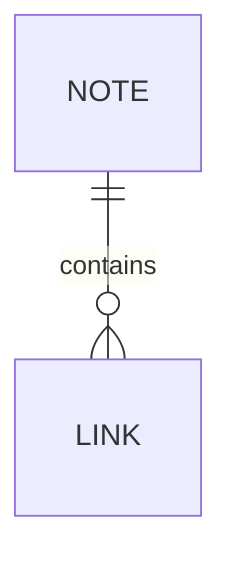

## Journey
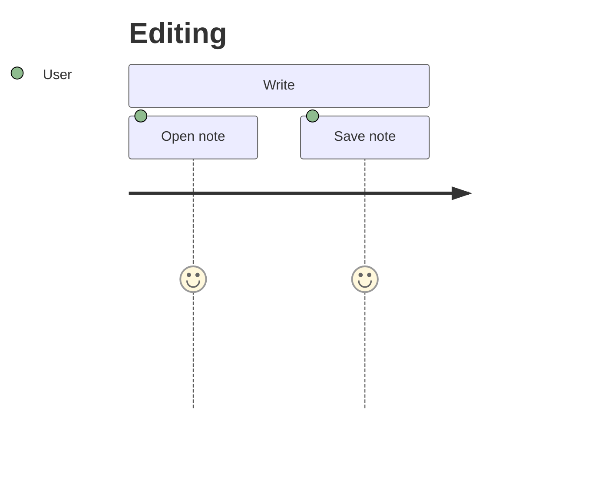

## Gantt
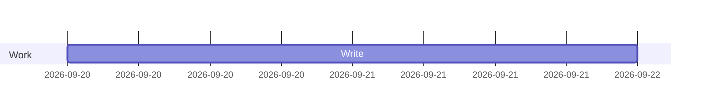

## Pie
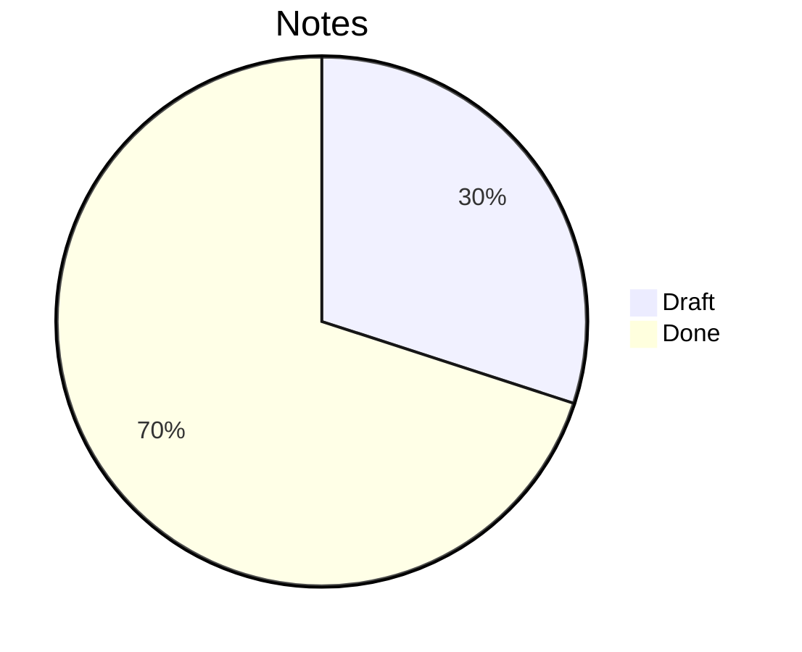

## Quadrant
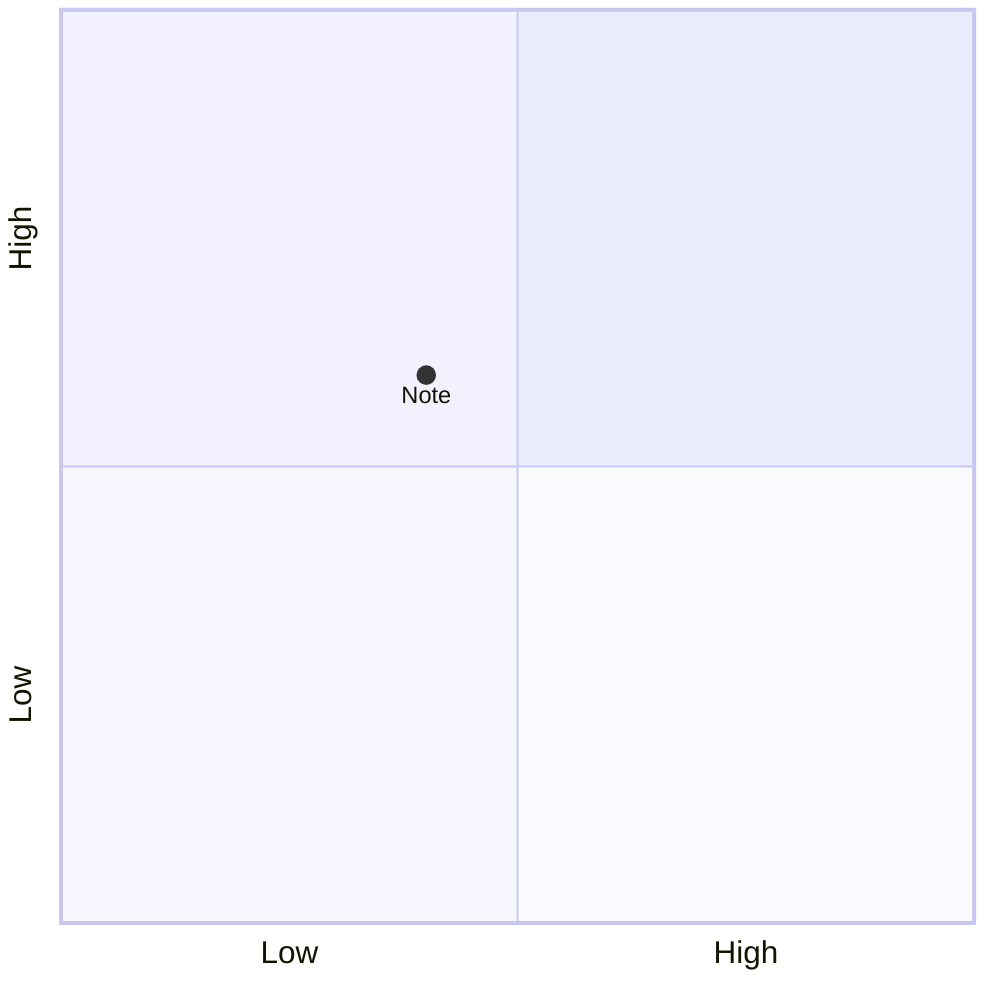

## Requirement
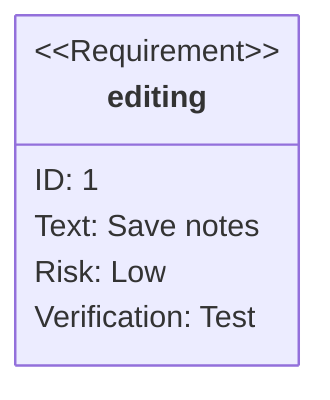

## Git
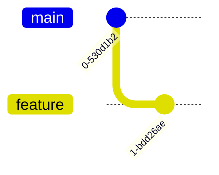

## Mindmap
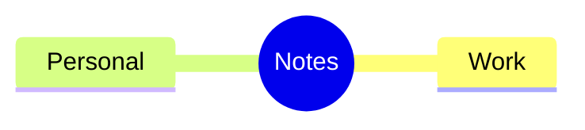

## Timeline
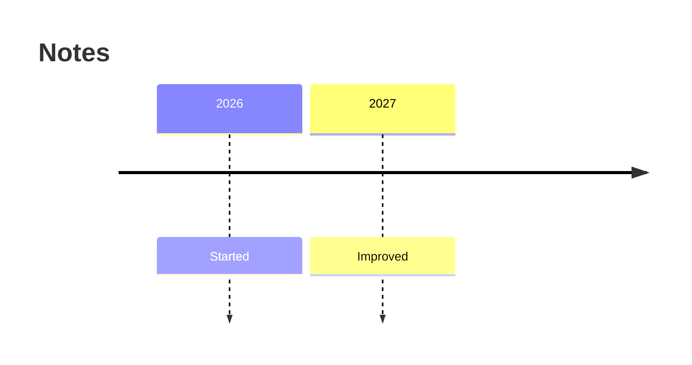

## ZenUML
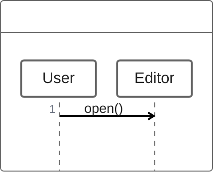

## Usecase
```mermaid
usecase-beta
  actor User
  Edit(Edit note)
  User --> Edit
```

## Swimlane
```mermaid
swimlane-beta
  subgraph User
    A[Write]
  end
  subgraph Editor
    B[Save]
  end
  A --> B
```

## Sankey
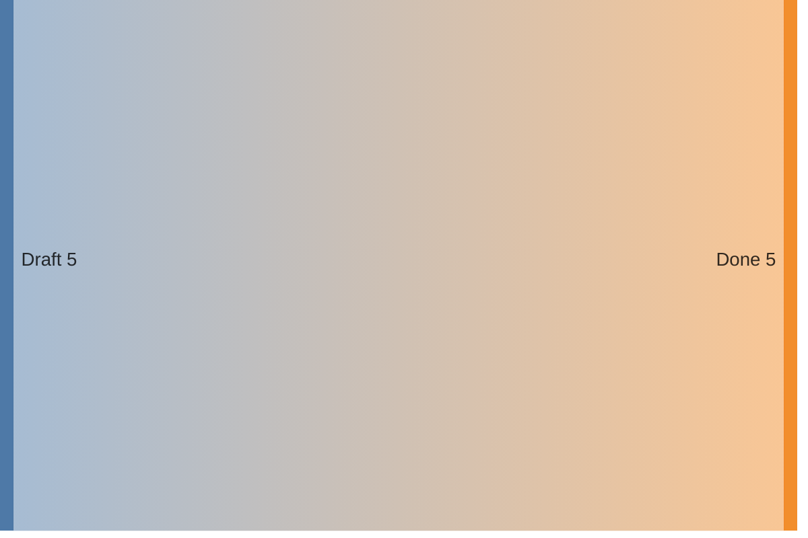

## XY
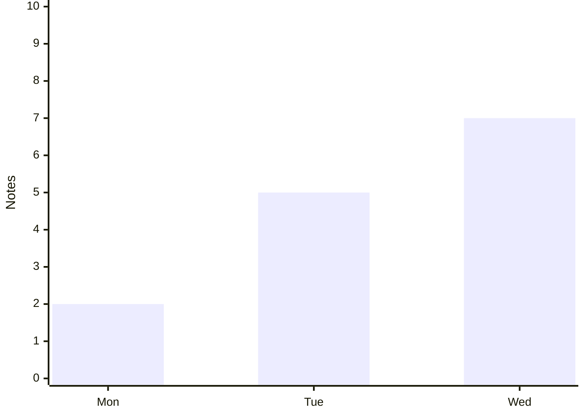

## Block
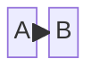

## Packet
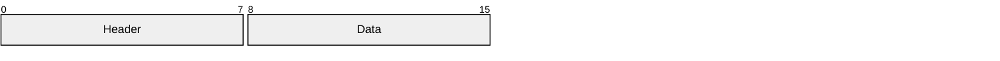

## Kanban
```mermaid
kanban
  todo[To do]
    a[Write]
  done[Done]
    b[Read]
```

## Architecture
```mermaid
architecture-beta
  service editor(server)[Editor]
  service notes(database)[Notes]
  editor:R -- L:notes
```
